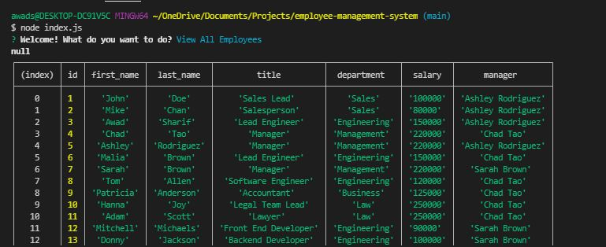
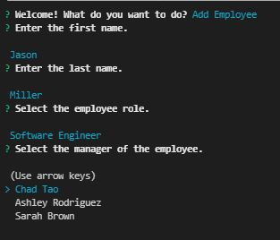
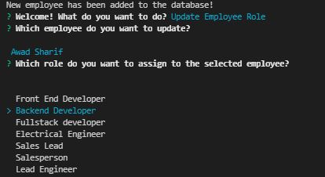
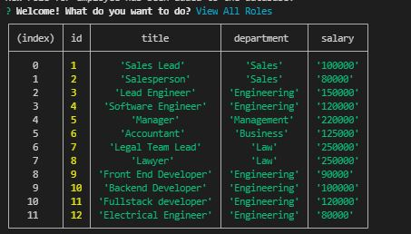
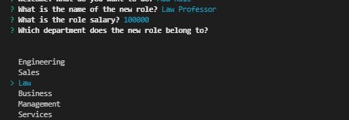
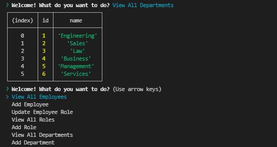
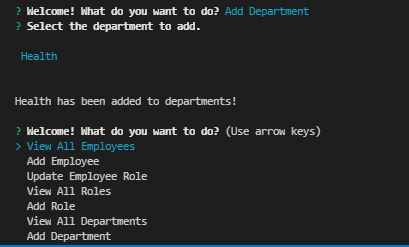

# employee-management-system

Employee Management system is a program that allows one to do the following:

- View all employees in the database

- View all existing roles and job departments

- Allows users to add additional employees, roles, and departments along with their corresponding manager.

- Update existing employees by assigning them new roles.

This was created using Javascript, Inquirer library to take inputs from the user, and MySQL2 library to retrive information from SQL databases.

# Demo of Project

The following video demos functionality on how to utilize the employee management system program.

# Screenshots of project

The user is initially presented to the main webpage with the option to view, add employee/department/role, or to update an existing role for a corresponding user.

If the user selects "View All Employees", the user is able to see all the employees in the database based off their names, title, department, salary and who their manager is.

If the user selects "Add Employee", the user can the employee's first name, last name, select a role from the roles database, and the manager from the managers database.

If the user selects "Update Employee Role", the user can update the role of an existing employee to a new role based off the role choices provided.

If the user selects "View All Roles", the user can see all the roles in the existing database based off title, department, and salary of each role.

If the user selects "Add Role", the user can add a role by providing the name of the new role, its salary, and selecting the department the role belongs to.

If the user selects "All Departments", the user can see all the departments from the departments database.

If the user selects "Add Departments", the user can add the name of the department that then gets added to the department database.

